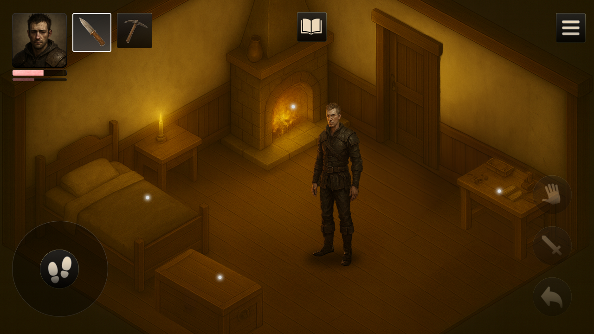

### Mobile Survival Game - Case Study

Product Description Decay is a narrative-driven survival & management game set in a dark medieval world. The project delivers mobile-first strategy gameplay with moral choices, systemic economy, and exploration, later expanding to PC/console.

### Project Files

Business Analysis Plan I Case Study Documentation I Behance Documenation

- [Business Analysis Plan](https://docs.google.com/document/d/1MJ7V4jpOxj-_vzXpU0pklFwasL8elmdxT1HwzeHDSOM/edit?usp=sharing)

- [Case Study Documentation](https://docs.google.com/document/d/15zeO6TtC_wGXV7k0uzWpwYxEMyE6AIz7vtqR_7jQCoM/edit?usp=sharing)

- [Behance Documenation](https://www.behance.net/gallery/233870289/Mobile-Product-Design-Survival-Game)

The initiative covers full-cycle production from business analysis and system design to UX/UI prototyping, core loop validation, and player testing.

My role: business analysis, gameplay system modeling, UX research, and interactive UI design (wireframes, usability tests, Figma prototypes, Confluence documentation).

Scope areas: market analysis, stakeholder mapping, process modeling, use case design, prototype validation, and iterative MVP planning.
